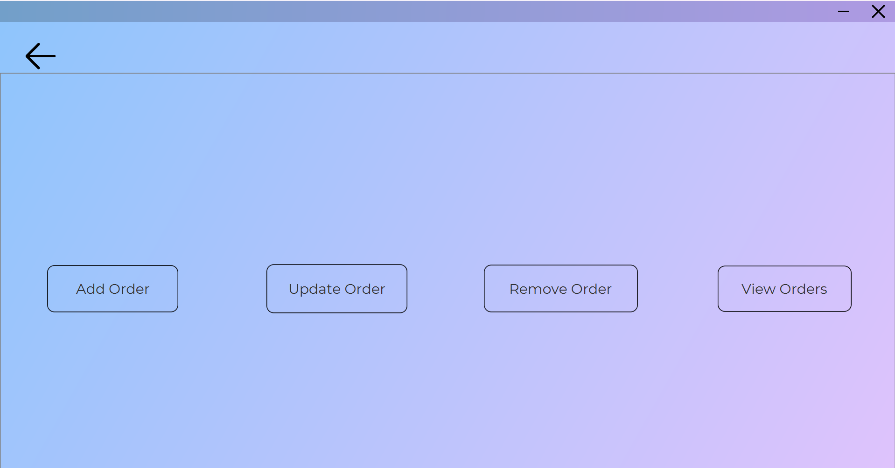
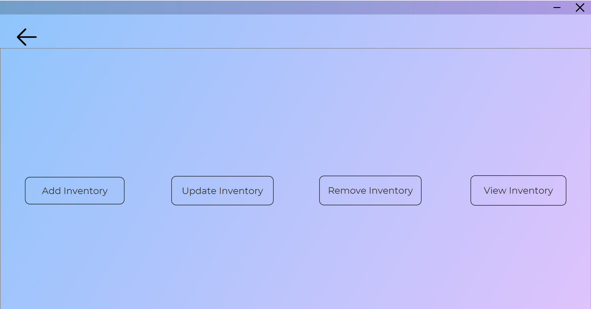
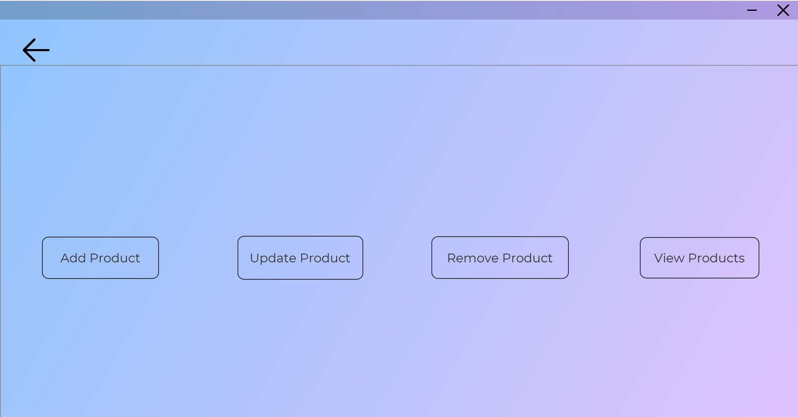
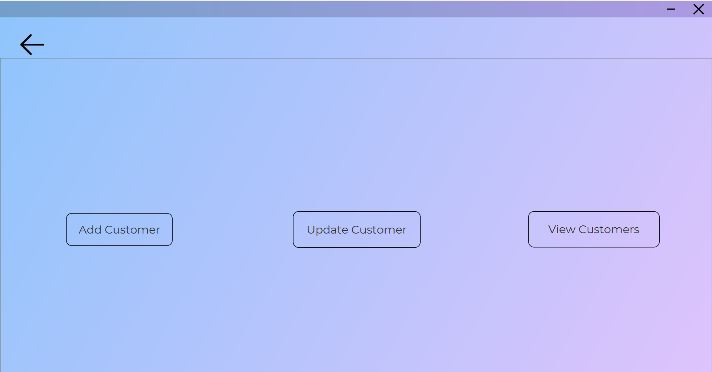
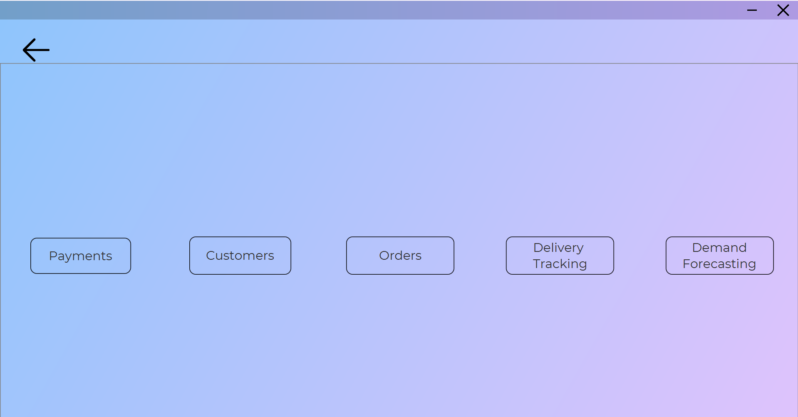
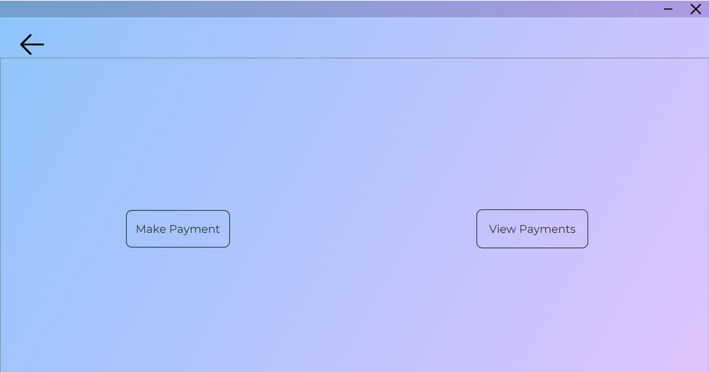
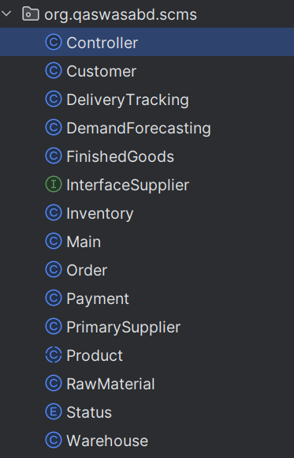
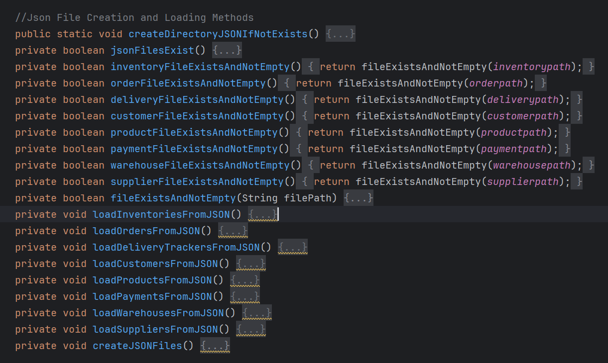
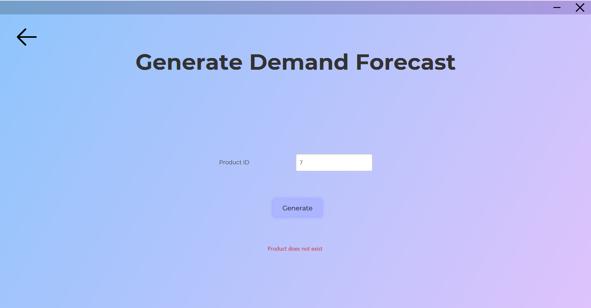
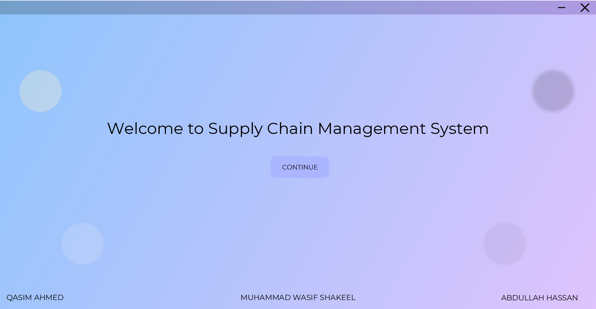

# Supply Chain Management System Using OOP

## Project Description

The Supply Chain Management System (SCMS) aims to optimize supply chain processes, enhancing efficiency and reducing costs. It includes modules for product, supplier, order, inventory, customer, warehouse, payment, delivery tracking, and demand forecasting. SCMS provides real-time visibility and streamlined operations through standardized JSON data interchange.

## Technologies Used

- Java
- JavaFX
- Scene Builder
- Apache Commons Math

## Setup and Run Instructions

### Prerequisites

- IntelliJ IDEA 2023.3 (or later version) installed on your system.
- Java Runtime Environment.

### Setup Instructions

1. Clone the project repository from the source, or download it as a ZIP archive and extract it to your local machine.
    ```bash
    git clone https://github.com/mwasifshkeel/supply-chain-management.git
    ```
2. Launch IntelliJ IDEA 2023.3 on your computer.
3. Open the project by selecting "Open Project" from the welcome screen or navigating to `File > Open` and selecting the project directory.
4. Trust the author of the project if prompted to do so by IntelliJ IDEA.

### Running the Project

1. Locate the main class of the project, typically the class containing the `main` method.
2. Click on the "Run" button in the toolbar or right-click on the main class file and select `Run <MainClassName>` from the context menu.

## Key Features and Functionalities Implemented

1. **Order Management**:
    - Ability to create, track, and manage orders.
    - Order status updates (e.g., processing, shipped, delivered).
    - Order history and tracking.
    
    

2. **Inventory Tracking**:
    - Monitor stock levels.
    - Update inventory quantities.
    - Handle restocking from suppliers.
    
    

3. **Supplier Interaction**:
    - Manage supplier information.
    - Place orders with suppliers.
    - Schedule deliveries.
    
    

4. **Product Information Management**:
    - Maintain detailed product information.
    - Include pricing, descriptions, and specifications.
    
    

5. **Customer Management**:
    - Store customer details (contact info, order history).
    - Enhance customer service.
    
    

6. **Order Processing Workflow**:
    - Automate order processing from placement to delivery.
    - Handle payment processing.
    
    

7. **Payment Handling**:
    - Securely process payments.
    - Support multiple payment methods.
    
    

8. **Object-Oriented Design**:
    - Create classes corresponding to entities in the UML diagram (e.g., Order, Inventory, Supplier).
    - Implement inheritance and encapsulation.
    
    

9. **File Handling**:
    - Use JSON to store data.
    
    

10. **Error Handling**:
    - Prevent user from typing illegal characters in `TextField`.
    - Utilize try-catch blocks to manage errors.
    
    

11. **JavaFX**:
    - Use JavaFX for GUI.
    
    

## Authors

- Muhammad Wasif Shakeel (456092)
- [Qasim Ahmed (457282)](https://github.com/qasimahmed06)
- [Abdullah Hassan (479819)](https://github.com/AbdullahHassan192)

## License

Distributed under the MIT License. See `LICENSE` for more information.

## Acknowledgements

- [Java](https://docs.oracle.com/en/java/)
- [Maven](https://maven.apache.org/guides/index.html)
- [JavaFX](https://openjfx.io/openjfx-docs/)
- [IntelliJ IDEA](https://www.jetbrains.com/help/idea/getting-started.html)
- [FasterXML Jackson JSON](https://github.com/FasterXML/jackson/blob/master/MANUAL.md)
- [Apache Commons Math](https://commons.apache.org/proper/commons-math/)
- [JSON](https://github.com/stleary/JSON-java)
- [All Icons](https://www.svgrepo.com/)
- [Scene Builder](https://docs.gluonhq.com/)
